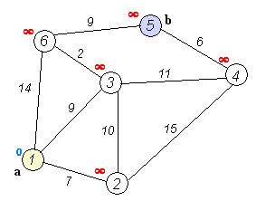

# Dijkstra

A implementation of Dijkstra's Algorithm for search the shortest path in a graph.

## Instalation and Usage

I suppose you are using a Linux-distro or you have the `automake` installed on Windows. Then open a terminal instance and execute only:

  * git clone https://github.com/ryukinix/dijkstra
  * cd dijkstra/C
  * make
  * ./dijkstra.out

## Contributing

1. Fork it!
2. Create your feature branch: `git checkout -b my-new-feature`
3. Commit your changes: `git commit -am 'Add some feature'`
4. Push to the branch: `git push origin my-new-feature`
5. Submit a pull request :D

## History

I lost my mind. I even not know what are doing here.

## Credits

  * Me (Manoel Vilela)

## License

GPLv3